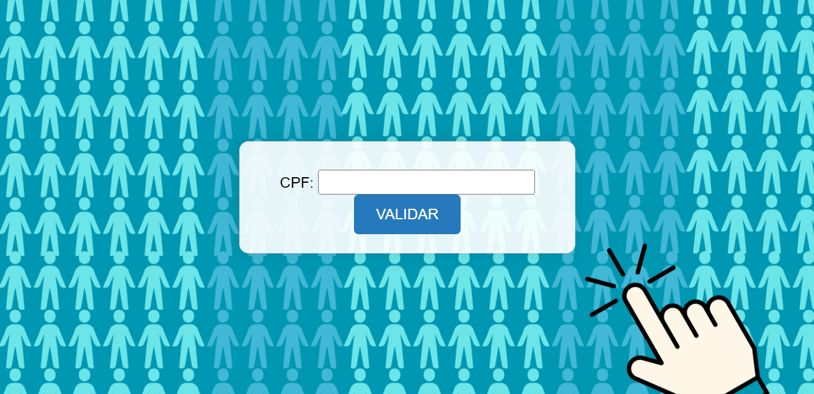

# ❤️ BEM VINDO AO MEU PROJETO DE VALIDAÇÃO DE EMAIL/CPF

## Validação de Email 📧
Visão Geral
Este projeto consiste em um formulário simples em HTML que utiliza um script em JavaScript para validar endereços de email. O objetivo é oferecer aos usuários uma maneira fácil de inserir um email e verificar se ele está em um formato básico aceitável.

## 🔐 Principais Funcionalidades:

Campo de Email: Um campo de entrada onde os usuários podem digitar seu endereço de email.

Validação Automática: A validação ocorre automaticamente quando o usuário sai do campo de entrada (evento onblur), verificando se o email contém pelo menos um '@' e um '.'.

Feedback ao Usuário: Após a validação, uma mensagem é exibida indicando se o email inserido é válido ou se precisa ser corrigido.

Como Usar
Inserção de Email: Insira seu endereço de email no campo designado.

Validação: Ao clicar fora do campo de entrada, a validação é realizada automaticamente.

Mensagem de Feedback: Uma mensagem aparece imediatamente indicando se o email é válido ou se há algum erro que precisa ser corrigido.

## 🧩 Validação de Email

🔧 HTML: Estruturação do formulário de email, incluindo campo de entrada e mensagem de feedback.

🎨 CSS: Estilização para destacar o campo de email e a mensagem de feedback, garantindo uma apresentação visualmente atraente e intuitiva.

💻 JavaScript: Implementação da validação de email para verificar se o formato inserido é válido, fornecendo feedback instantâneo ao usuário

🧩 Validação de Email
🔧 HTML: Estruturação do formulário de email, incluindo campo de entrada e mensagem de feedback.

🎨 CSS: Estilização para destacar o campo de email e a mensagem de feedback, garantindo uma apresentação visualmente atraente e intuitiva.

💻 JavaScript: Implementação da validação de email para verificar se o formato inserido é válido, fornecendo feedback instantâneo ao usuário
Feedback Instantâneo: Notificações imediatas ajudam os usuários a corrigir erros rapidamente.

Facilidade de Uso: Interface simples e direta para inserir e validar emails.

Este README foi desenvolvido para fornecer uma visão clara e instruções detalhadas sobre como utilizar e beneficiar-se do formulário de validação de email.

# ❤️ veja a ilustração do meu projeto de Email !

# 🎉 Validador de CPF

### Visão Geral

Este projeto consiste em um formulário simples em HTML que utiliza um script em JavaScript para validar números de CPF. O objetivo é oferecer aos usuários uma maneira fácil de inserir um CPF e verificar se ele é válido de acordo com os critérios estabelecidos.

### 🔐 Principais Funcionalidades

Campo CPF: Um campo de entrada onde os usuários podem digitar seu número de CPF.

Validação Automática: A validação ocorre quando o formulário é submetido, verificando se o CPF inserido é válido.

Feedback ao Usuário: Após a validação, uma mensagem é exibida indicando se o CPF é válido ou se precisa ser corrigido.

### Como Usar

Inserção de CPF: Insira seu número de CPF no campo designado. O formato deve ser apenas números, sem pontos ou traços adicionais.

Validação: Clique no botão "VALIDAR" para verificar se o CPF é válido.

Mensagem de Feedback: Uma mensagem aparece imediatamente indicando se o CPF é válido ou inválido.

### 🧩 Validação de CPF

HTML: Estruturação do formulário de CPF, incluindo campo de entrada e mensagem de feedback.

CSS: Estilização básica para garantir uma apresentação visualmente atraente e intuitiva do formulário.

JavaScript: Implementação da lógica de validação para verificar se o CPF inserido atende aos critérios necessários.

### 🌸 Benefícios

Feedback Instantâneo: Notificações imediatas ajudam os usuários a corrigir erros rapidamente.

Facilidade de Uso: Interface simples e direta para inserir e validar CPFs.

Este projeto foi desenvolvido para fornecer uma forma eficaz de validar CPFs de maneira fácil e intuitiva.

# ❤️ veja a ilustração do meu projeto de CPF !

# 🎉 linkedin
Este projeto será documentado no LinkedIn para compartilhar meu trabalho e experiência com a comunidade.

# 📝 Autoria:
Este projeto é uma criação ´´Luamy Alves Gama´´ desenvolvido com paixão e dedicação para proporcionar uma experiência excepcional aos usuários.